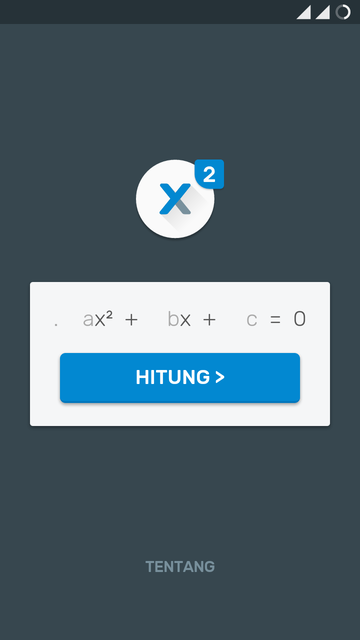
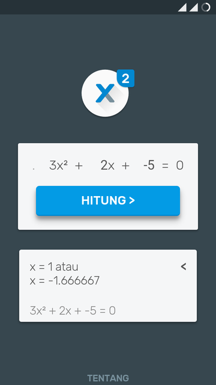
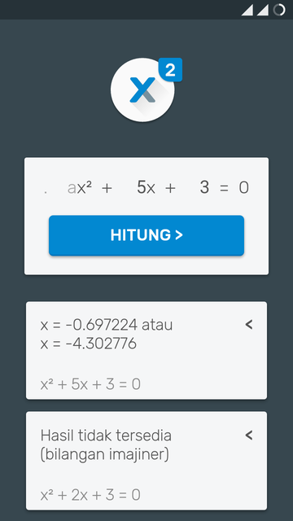
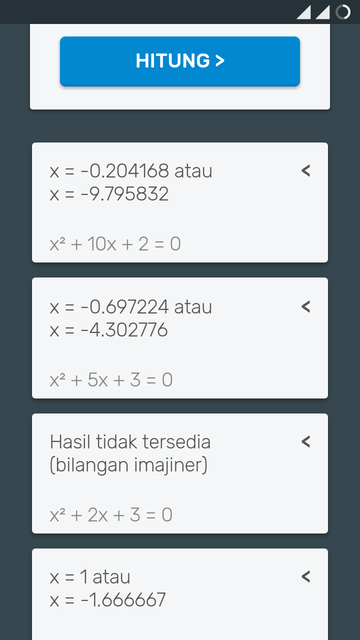

#xkuadrat

Coba langsung di browser : [mzpsh.github.io](https://mzpsh.github.io/xkuadrat)

[Unduh](https://github.com/mzpsh/xkuadrat/releases/tag/release)

Aplikasi web sederhana untuk memecahkan persamaan kuadrat.
Ditulis dengan HTML,CSS dan JavaScript tanpa tambahan library eksternal.
  
Menggunakan font *Rubik*, Hak cipta (c) 2015 oleh Hubert & Fischer.

**Tampilan**

